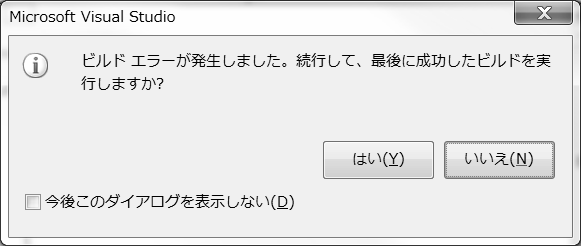
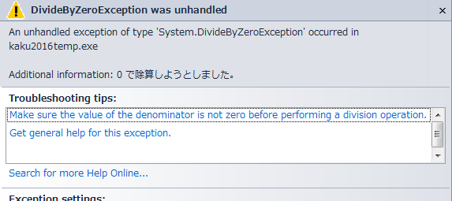

# 問題の解消＝デバッグ

## エラーウィンドウ
以下のようなウィンドウが表示されたら「はい」「いいえ」を選ぶこと。

### このウィンドウが表示されない時
エラーのはずなのにプログラムが実行されたり、紹介しているものと違うエラーウィンドウが表示される場合は以下を確認する。

- ツールメニュー＞オプションを選ぶ
- 左の一覧から プロジェクトおよびソリューション の左の三角をクリックして開く
- ビルド/実行 を選択
- 実行時に、ビルドまたは配置のエラーが発生したとき の欄を、 **起動しない** に変更して、OKをクリック

## エラー場所を見つける方法

## ユーザーが処理していない例外 ウィンドウ
以下のようなエラーが表示された時の対処方法を記せ。

### 対処方法

?

## 初心者の代表的なエラー原因
1.
2.
3.
4.
5.
6.

また、 Visual Studio で気を付けなければならないことを以下に記せ

** ? **

---

[前へ](README.md#%E3%83%97%E3%83%AD%E3%82%B0%E3%83%A9%E3%83%9F%E3%83%B3%E3%82%B0%E3%81%AE%E8%82%9D) | [目次へ](README.md#%E7%9B%AE%E6%AC%A1) | [次へ](04.md)
